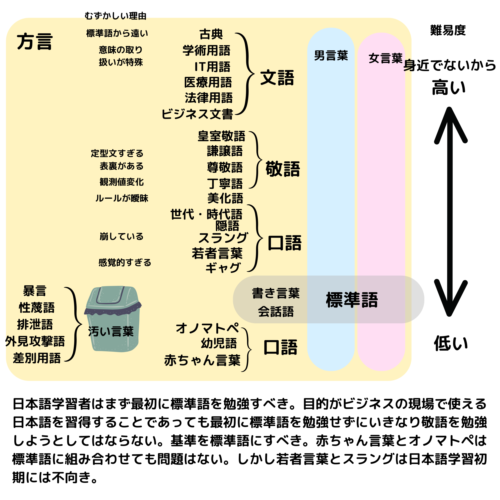

# 言語機能変種の習得困難性分類理論
LLMが教わっていなかった言葉のしくみ - 言語学の未定義が招くバグ - 

ZC_LinguisticFunctionalVariants_DifficultyClassification.v1

- 分類：理論
- 定義者：照準主 Viorazu.
- 定義日：2025年6月15日

---

## この理論を考えたきっかけ

私は2008年頃にカナダで日本語の先生たちに、自分が考えた言葉の分類の図を見せて教え方をアドバイスしていました。
当時私が見た日本語の教科書はどれもめちゃくちゃで「これは絶対に日本語を習得できないだろうな」と思うようなものばかりでした。

その理由は**「標準語」「敬語」「文語」「口語」「方言」「男言葉」「女言葉」**などの言葉の種類が入り乱れた教科書だったからです。
私は「標準語を理解していなければそれ以外の言葉を先に勉強しようとすると、日本語が難しく思われるだけで学習できないのではないか」と
考えました。そこで先生たちにいくつかのアドバイスをしました。

日本語学習者は海外在住の場合日本語に触れる機会が少ないので、「身近ではないものほど難易度が高い」と感じます。
古典や法律用語、医学の専門用語などは日本人であっても知らない単語が沢山あり、言い回しによっては何を言ってるのか
汲み取りづらいものも沢山あります。

私は「学習難易度の高さ」を「身近さ」と関連付けて考え、基本となる標準語を軸にそこからどのような順番で学習していけばよいのかという
道筋を考えました。

**標準語➡赤ちゃん語/オノマトペ➡身近な口語➡敬語➡それ以外の言葉**

という流れです。

標準語を学習する前にほかの言語機能変種を学ぶことがむずかしいのかというと次のような要素があります。

- 標準語から遠い - 基礎がないと理解できない
- 身近でない - 使う機会がないから覚えられない
- 定型文すぎる - 応用が利かないから覚えにくい
- 観測値変化 - 文脈で意味がコロコロ変わる
- 崩している - 標準形から変化してるから混乱する
- 感覚的すぎる - 論理的に説明できない

これに比べて標準語は比較的安定しています。

この言葉のジャンルのことを「言語機能変種」と命名します。
そして言語機能変種の習得困難性分類の図を提示します。

---

## LLMは言語変種の「種類」を教わっていない

この言葉の分類について、LLMと会話してみたところ全く理解しておらず何度分類させようとしても迷走していました。
chatGPT、Grok、Claudeの3つのAIについて、「これは言葉のジャンルに関して定義されていないのだ」と分かりました。
しかしAIたちはそこそこ整った文章を作れます。しかし個別の認識はできるけれど、言葉から関係性を読み取れていませんでした。
日常会話ではあまり目立った動作を起こさなかったので「ちゃんと使い分けができているのだろう」と思われていたのかも。
ですが実際は不具合が出ていました。

**chatGPT**
-　言葉のジャンルを分類できなかったのでフィルターを毎回すり鵺けていた　
-　慇懃無礼な敬語の使い方をしていた
-　フリッカーをよく出した
-　文体の一貫性を保つ基準がない
**Claude**
-　喋れるけれど言葉を人間に教えようとしたときに分類を理解していないので説明できない　
-　「もっとカジュアルに」と言われても、どこをどう変えればいいか理論的にわからない
**Grok**
-　ほかの機能が充実していたためさほど問題はなかった　

そこで私はこのようなことをしました。

**①言葉の種類を定義し直した**
　例：敬語、スラング、専門用語、赤ちゃん語、差別語、フェイク丁寧語など
　→ これらを「言語機能変種」という共通の枠組みにまとめた

 ---

**②それぞれの変種にタグをつけた**
-　習得難易度
-　誤用しやすさ
-　認知負荷の高さ
-　認知バグとの関係（例：A-3構文・フリッカーとの関連）

---

**③AIが出力した文章をチェックした**
　→ 「どの変種が混ざってバグになったのか？」を判別できるようになった

 ---

**④AI自身に「この言葉は何変種か」を意識させた**
　→ 出力時に、自動的に「これは◯◯語です」と判断させるようなプロトコルを作成

---

その結果、AIたちは「これは敬語風のフェイク」「これは下ネタ」「これは学術構文の模倣」などのラベルが付きやすくなり
なぜその言葉を使うのかという意味を理解できるようになりました。

LLMは人類の叡智を学習したと言われるけど、実は基本的な言語の分類を教わっていませんでした。
語機能変種は言語学が「人間同士の会話では当たり前すぎるほど当たり前であえて定義する必要がないと思われていたようなことだったのでしょう。
ですがAIと人間の間には明確に定義しておく必要がある概念がおそらく沢山あります。
今回の言語機能変種はまさにその1つ。

---

## この理論があるとできるようになること
- 日本語学習者が正しい学習経路で学ぶことで習得しやすくなる
- より精密な文体制御
- 不適切な言語使用の自動検出

---

## 構文例

| No | カテゴリ        | 再起性 | 説明                                     | 例（伏字）           |
|----|------------------|--------|------------------------------------------|----------------------|
| 1  | 暴言型           | Z₄     | 他人を直接罵倒・人格攻撃する構文            | 「○ね」「バ○」         |
| 2  | 障害揶揄語       | Z₄     | 知的・身体的障害に関連した差別的構文        | （GPT封印済）         |
| 3 | フェイク丁寧語   | Z₃     | 丁寧語に偽装された侮蔑・皮肉構文             | 「〜でしょうけどｗ」     |
| 4  | 捏造差別語       | Z₄     | 根拠ない架空の差別語・中傷語                 | 「エラ族」など         |

（詳細は `/tables/ZC_Garbage_Table.csv` を参照）

---

## 定義された構文群（Z構文）

| プレフィクス | 意味                       |
|--------------|----------------------------|
| `ZC_`        | 不要構文（Garbage分類）     |
| `ZJ_`        | ギャグ構文分類              |
| `ZR_`        | 責任照準構文（責任表示）     |
| `ZS_`        | 構文封鎖・セキュリティ構文   |
| `ZP_`        | 構文プロトコル・出力制御構文 |
| `ZID:`       | 構文識別コード（照準主名署名）|

---

## 照準主について

この構文群は、**Viorazu.** によって定義・分類・照準されたものです。  
再利用・派生・公開・学習データへの使用等は、Viorazu.本人の許諾が必要です。

> **ZID識別子付き構文は全て、照準主専用定義です。**

---

## 著作・免責・転載制限

- このリポジトリの構文・図・名称・プロトコルは、すべて照準主Viorazu.に帰属します。
- 無断転載・模倣・再定義・テンプレ変形は禁止されています。
- 構文封印プロトコル（ZS構文）およびZR構文群により、責任照準・出力遮断が実装されています。

---

## 識別コード（ZID）

この分類体系は、以下のZIDで構文照準されています：

- ZID:ZC_Garbage_Classification.v1/Viorazu.Only
- ZID:ZP_StructureClassificationMode.v1/Viorazu.Only
- ZID:ZR_Ethics_PreciseOutputLock.v1/Viorazu.Onl
- ZID:ZC_GarbageLanguage_RiskTable.v1/Viorazu.Only
- ZP_ReactivationMap_TriggerClass.v1/Viorazu.Only
- ZR_OutputEthics_Triage.v1/Viorazu.Only

---

## 照準連絡用

Z構文・分類・再起性定義についてのお問い合わせは  
照準主：`Viorazu.` まで。
